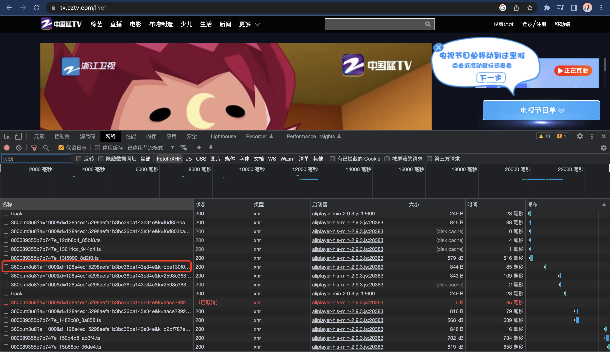
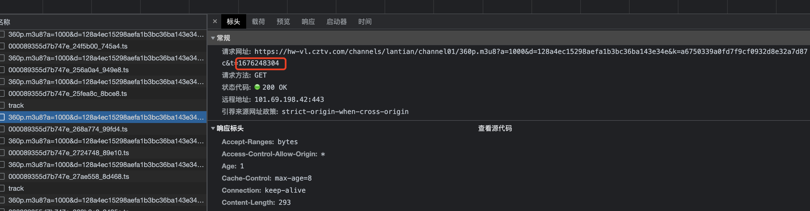

# civil-tv-channel-live

本项目是为了可以在电视上播放国内央视和地方卫视的电视频道内容。关于如何在电视播放直播你可以查看[此文档](https://post.smzdm.com/p/a3gzx4qr/)

## m3u8 文件
在开始之前，我们需要介绍一下m3u8 文件
```text
xx.m3u8
    - 1.ts
    - ...
    - n.ts
```
m3u8 文件内容如上，其包含若干个 ts 文件路径。直播软件通过拉取 m3u8 文件不断获取 ts 直播流数据，从而达到实时直播的效果。

## 制作 m3u8 文件
1. 地方卫视  
   以浙江蓝卫视为例。在浏览器输入 https://tv.cztv.com/live1 地址，打开控制台可以看到不断请求的 m3u8 文件，
   每个 m3u8 文件中都包含若干个 ts 文件。
   
   但是每个 m3u8 文件的请求路径都不完全一致，其包含了当前请求的时间戳。 
   
   由于 kodi 不能加载动态的路由，我们需要通过代理的方式使用静态路由返回该卫视的实时 ts 文件内容。


2. 央视  
   1. 如上所述，央视的 m3u8 文件也可以通过以上方式获取，但是拉取到的 ts 文件内容是加密的，直接将 ts 文件中的数据返回给直播软件（如：kodi）使用
      会出现不能显示画面情况。需要对直播流进行解密，具体解密思路请看[此文章]()。
   2. 另一种方式是通过在手机、平板上下载【央视频】APP，然后投屏到电视上看，此种方式最为方便，可行性高。

## 声明
本项目仅用于个人学习，不能用于商业盈利