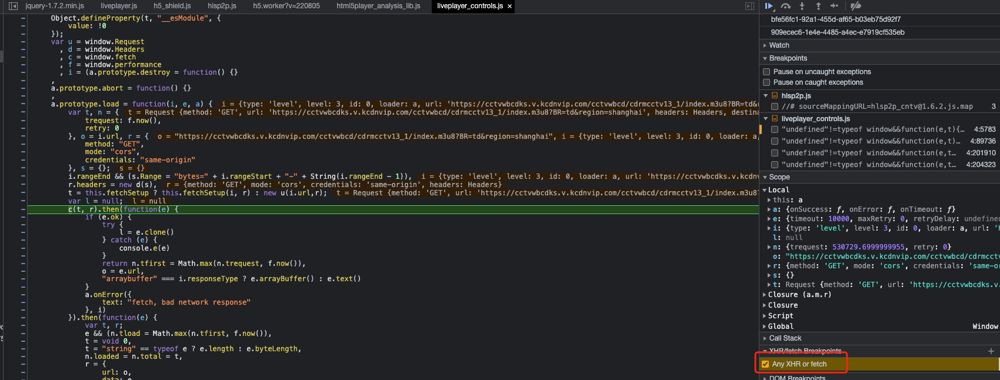
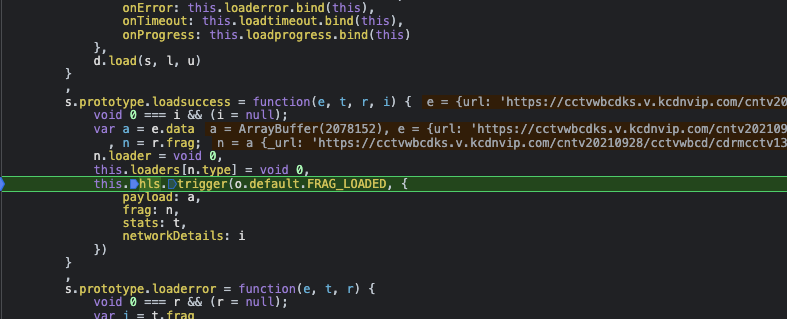
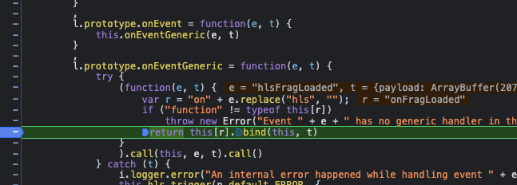
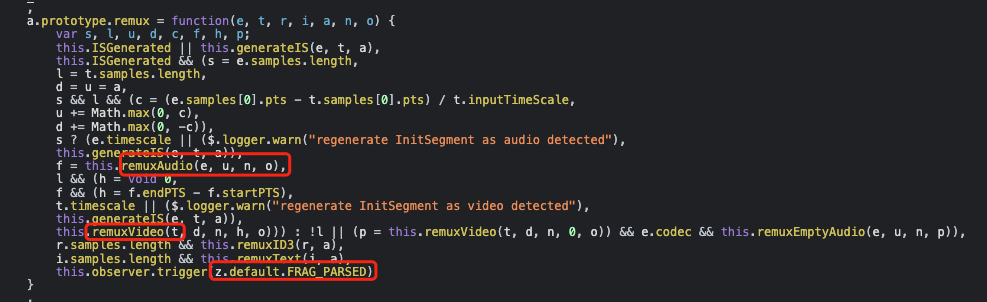
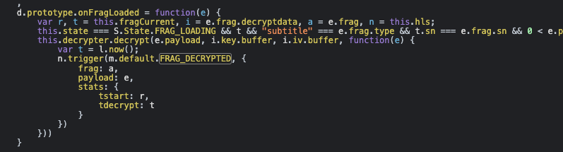

# cctv 直播流数据解密
由于 cctv 直播流数据是加密的，直接将其 m3u8 文件路由放入到 kodi 中使用，是不会显示画面效果的。
所以需要将其数据进行解密获取纯净的直播流，以方便在电视上通过直播软件进行播放。

查找思路：
1. 由于网页不断拉取 m3u8 文件以获得直播流数据，实现直播效果，所以可以从此开始
2. 通过文件下载后的调用链路找到解密和播放的方法
3. 通过模拟解密算法抓取纯净直播流

## 解密流程
1. 第一步我们需要找到下载 m3u8 文件下载代码的入口。如果使用人工查看代码的方式，进度会较慢，我们可以使用
浏览器的断点找到下载的入口。打开浏览器，启用 XHR/fetch BreakPoints -> Any XHR or fetch，找到下载代码

2. 然后进入请求成功回调方法中，我们可以看到其触发了一个 `FRAG_LOADED` 事件，通知观察者进行业务处理

3. 继续 debug，我们可以看到最终事件触发的通用处理方法为 onEventGeneric 方法

4. 事件类型有很多种，但跟流数据（frag：fragment 段）有关的事件只有以下几种：
   1. FRAG_LOADING 数据段加载
   2. FRAG_LOADED 数据段加载完毕
   3. FRAG_PARSING_INIT_SEGMENT 数据段解析初始化
   4. FRAG_PARSING_DATA 数据段解析
   5. FRAG_PARSED 数据段解析完毕
   6. FRAG_BUFFERED 数据段缓存
   7. FRAG_DECRYPTED 数据段解密
5. 代码中使用事件监听的模式来实现目的，一个事件可能有多个发布者发布和多个观察者进行处理。
可以找到以下几个疑似解密数据的地方：
   1. FRAG_PARSED 事件由 remux 方法触发，其中 remuxAudio 和 remuxVideo 似乎是音视频数据的解密
      
   2. FRAG_LOADED 事件处理方法中会触发 FRAG_DECRYPTED 事件
      
   
未完待续。。。

